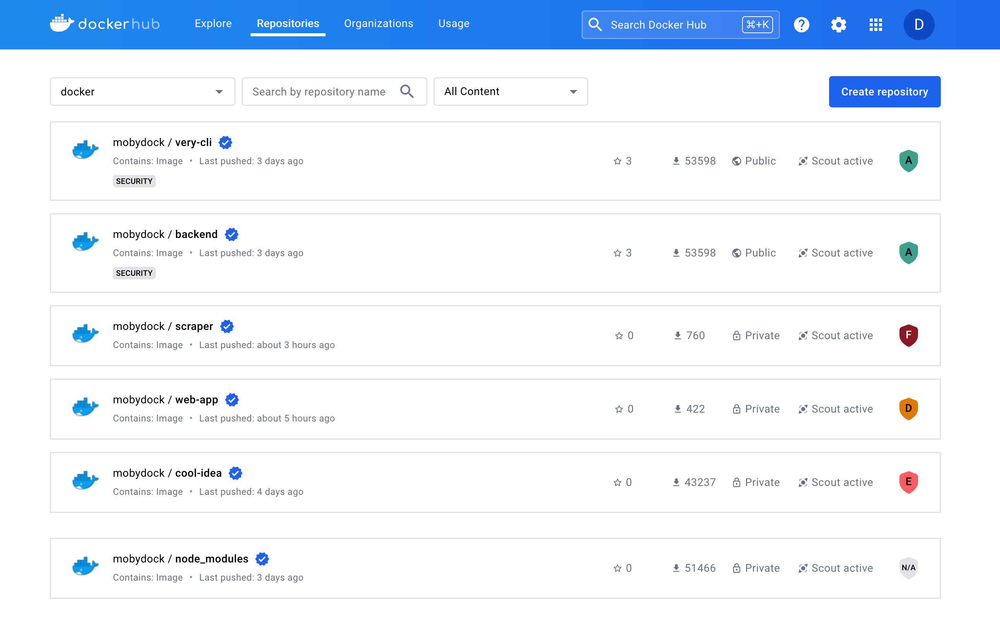

{}
Health scores is a [Beta](/release-lifecycle/#beta) feature of Docker Scout.
The feature is only available to organizations selected to participate in the
early access program.
{}

Docker Scout health scores provide a security assessment, and overall supply
chain health, of images on Docker Hub, helping you determine whether an image
meets established security best practices. The scores range from A to F, where
A represents the highest level of security and F the lowest, offering an
at-a-glance view of the security posture of your images.

Only users who are members of the organization that owns the repository, and
have at least “read” access to the repository, can view the health score. The
score is not visible to users outside the organization or members without
"read" access.

## Viewing health scores

To view the health score of an image:

1. Go to Docker Hub and sign in.
2. Navigate to your organization's page.

In the list of repositories, you can see the health score of each repository
based on the latest pushed tag.



The health score badge is color-coded to indicate the overall health of the
repository:

- **Green**: A score of A or B.
- **Yellow**: A score of C.
- **Orange**: A score of D.
- **Red**: A score of E or F.
- **Gray**: An `N/A` score.

The score is also displayed on the Docker Hub page for a given repository,
along with each policy that contributed to the score.


## Scoring system

Health scores are determined by evaluating images against a set of Docker Scout
[policies](./_index.md). These policies align with best practices for
the software supply chain and are recommended by Docker as foundational
standards for images.

Each policy is assigned a points value. If the image is compliant with a
policy, it is awarded the points value for that policy. The health score of an
image is calculated based on the percentage of points achieved relative to the
total possible points.

### Scoring process

1. Policy compliance is evaluated for the image.
2. Points are awarded based on adherence to these policies.
3. The points achieved percentage is calculated:

   ```text
   Percentage = (Points / Total) * 100
   ```

4. The final score is assigned based on the percentage of points achieved, as
   shown in the following table:

   | Points percentage (awarded out of total) | Score |
   | ---------------------------------------- | ----- |
   | More than 90%                            | A     |
   | 71% to 90%                               | B     |
   | 51% to 70%                               | C     |
   | 31% to 50%                               | D     |
   | 11% to 30%                               | E     |
   | Less than 10%                            | F     |

### N/A scores

Images can also be assigned an `N/A` score, which can happen when:

- The image is larger than 4GB (compressed size).
- The image architecture is not `linux/amd64` or `linux/arm64`.
- The image is too old and does not have fresh data for evaluation.

If you see an `N/A` score, consider the following:

- If the image is too large, try reducing the size of the image.
- If the image has an unsupported architecture, rebuild the image for a
  supported architecture.
- If the image is too old, push a new tag to trigger a fresh evaluation.

### Policy weights

The policies that influence the score, and their respective weights, are as follows:

| Policy                                                                                                     | Points |
| ---------------------------------------------------------------------------------------------------------- | ------ |
| [No fixable critical or high vulnerabilities](/scout/policy#no-fixable-critical-or-high-vulnerabilities)   | 20     |
| [No high-profile vulnerabilities](/scout/policy#no-high-profile-vulnerabilities)                           | 20     |
| [Supply chain attestations](/scout/policy#supply-chain-attestations)                                       | 15     |
| [No unapproved base images](/scout/policy/#no-unapproved-base-images)                                      | 15     |
| [No outdated base images](/scout/policy#no-outdated-base-images)                                           | 10     |
| [Default non-root user](/scout/policy#default-non-root-user)                                               | 5      |
| [No AGPL v3 licenses](/manuals/scout/policy/_index.md#no-agpl-v3-licenses)                                         | 5      |

### Evaluation

Health scores are calculated for new images pushed to Docker Hub after the
feature is enabled. The health scores help you maintain high security standards
and ensure your applications are built on secure and reliable images.

### Repository scores

In addition to individual image scores (per tag or digest), each repository
receives a health score based on the latest pushed tag, providing an overall
view of the repository's security status.

### Example

For an image with a total possible score of 90 points:

- If the image only deviates from one policy (for example, the Copyleft
  Licenses policy), it might score 85 out of 90, resulting in a score of A.
- If the image has fixable CVEs and other issues, it might score 65 out of 90,
  resulting in a score of B.

## Improving your health score

To improve the health score of an image, take steps to ensure that the image is
compliant with the Docker Scout recommended [policies](./_index.md).

1. Go to the [Docker Scout Dashboard](https://scout.docker.com/).
2. Sign in using your Docker ID.
3. Go to [Repository settings](https://scout.docker.com/settings/repos) and
   enable Docker Scout for your Docker Hub image repositories.
4. Analyze the [policy compliance](./_index.md) for your repositories,
   and take actions to ensure your images are policy-compliant.

Since policies are weighted differently, prioritize the policies with the
highest scores for a greater impact on your image's overall score.
